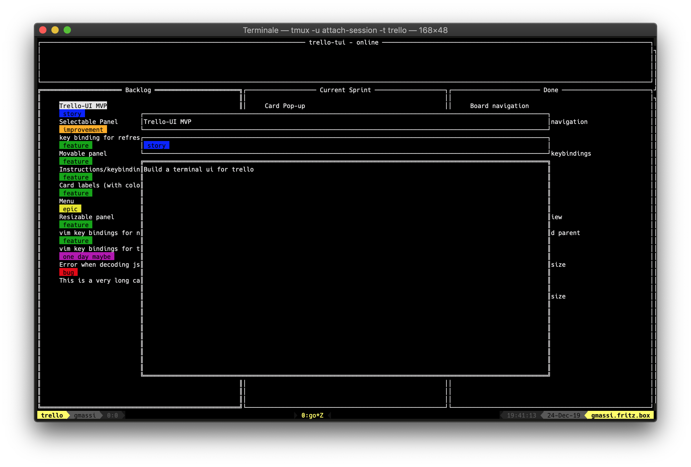

# trello-tui

[](https://godoc.org/github.com/giannimassi/trello-tui)
[](https://goreportcard.com/report/github.com/giannimassi/trello-tui)

#### A terminal ui for trello



###### Disclaimer
`trello-tui` is still a work in progress.
Roadmap includes:

- display user comments
- allowing the user to add comments
- filter cards displayed by label or text
- display linked cards
- navigate to linked cards
- open link in description or comment in browser
- display linked pull-requests or issues from github


### Installation
```bash
go get github.com/giannimassi/trello-tui
```

### Usage
The following environment variables are required to be configured:
```bash
export TRELLO_USER=user
export TRELLO_KEY=key
export TRELLO_TOKEN=token
```
#### Run:
```bash
trello-tui -refresh=30s -board="Board Name"
```

#### Flags:
```bash
-board string
      board name
-log
      Log to file
-refresh duration
      refresh interval (min=1s) (default 10s)
-vv
      Increase verbosity level
```